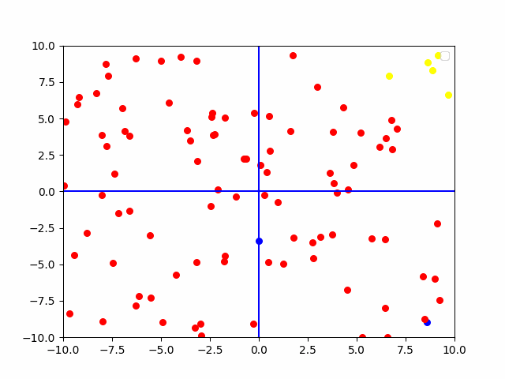

Introduction
This repository provides a Python implementation of the Red Fox Optimization (RFO) algorithm. Inspired by the hunting behavior of red foxes, RFO is a metaheuristic optimization technique suitable for solving a variety of problems.

Algorithm Overview
RFO simulates the hunting process of red foxes, dividing the search process into two primary phases:

Exploration: Foxes randomly search the solution space to discover promising regions.
Exploitation: Foxes refine their positions based on their current location and the best solution found so far.
The algorithm iteratively updates fox positions until a termination condition is met (e.g., maximum iterations, acceptable fitness value).

Article:  https://www.sciencedirect.com/science/article/abs/pii/S0957417420308599  

People who participated in the preparation of this resource:  
Mahdi Farahani:  
Linkdin:  https://www.linkedin.com/in/mahdi-farahani-3475ab31b/  
Mohammadreza Borjian:  
Linkdin:  https://www.linkedin.com/in/mohammadreza-borjian/  

Usage
To use the RFO algorithm:

Create a class and inharitance RedFox.py. after that implement fitness_function by your problem.

For use your custom class, you can create object of your custom class and your parameters and call run function.

redFox = RedFoxImp(2,100,-20,20,20)
redFox.run()

Parameters
RFO's performance can be influenced by several parameters:
dimension: Dimension count of problem
population_size: Population_size of foxes
L: Lower bounds of the search space
R: Upper bounds of the search space
itration: Maximum number of iterations

note: If your problem contains 2 features, you can see gif file of how this algorithm works. for see, you should call create_gif(your_gif_name).

example:  
 

Code Structure
The code is organized into:

RedFox.py: Contains the core RFO implementation.
RedFoxImp.py: Implemention of RedFox with custom fitness

Contributing
Contributions are welcome! Feel free to open issues or pull requests.

